# 表单设计

本节介绍，如何使用  

- 标题
- 网格布局
- 单行文本
- 上传文件
- 日期
- 数据表格  

等**基本控件**，设计一个数据表单。

## 1. 添加标题
在表单设计界面，点击基本控件栏中的**标题**控件，添加必要的标题。
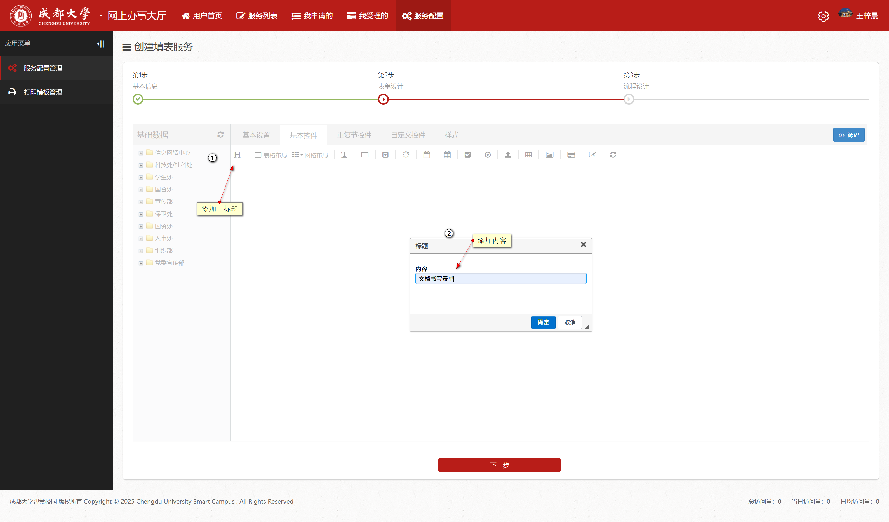

## 2. 添加网格布局
在表单设计界面，点击基本控件栏中的**网格布局**控件，添加两个四列和一个一列的网格布局。
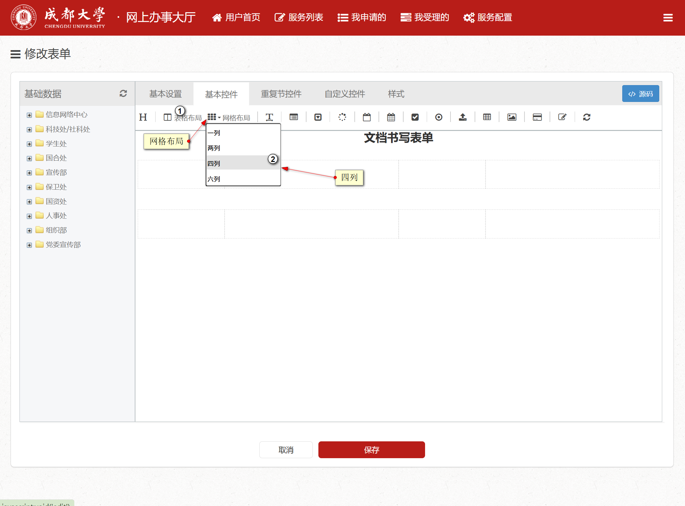
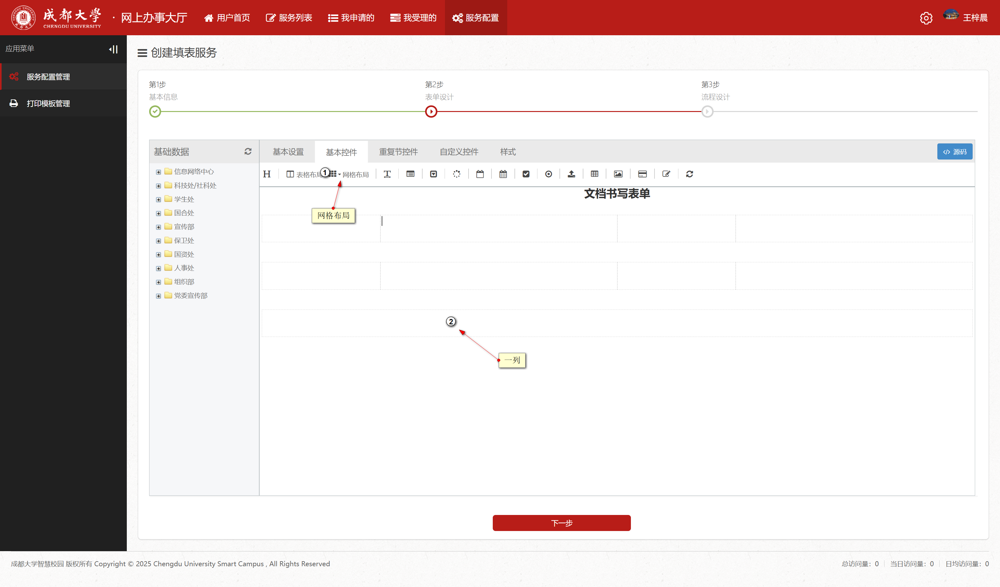

## 3. 填写基本信息
在网格布局中填写基本信息
- 在第一个四列网格布局中，分别填写姓名、学号。
- 在第二个四列网格布局中，分别申请文件、申请时间。  

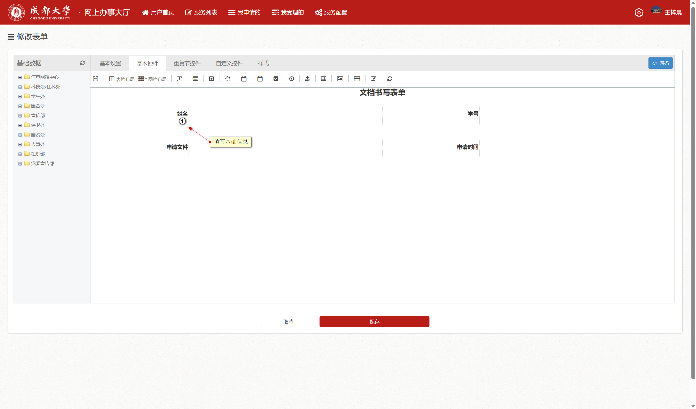

## 4. 添加单行文本
在第一个四列网格布局中，点击**单行文本**控件。  
- 请必须修改名称和ID（ID为拼音首字母）  

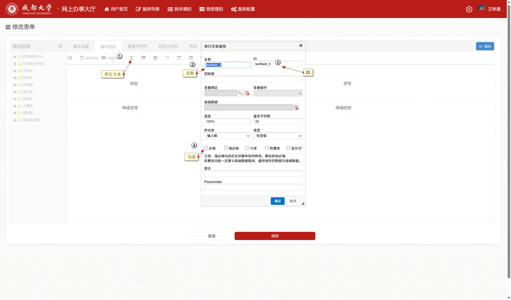
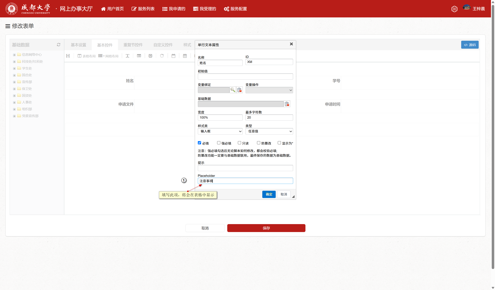  

> 如果填写placeholder，则在表单中会显示提示信息。  
- 接着同样的操作学号单元格，添加单行文本控件  

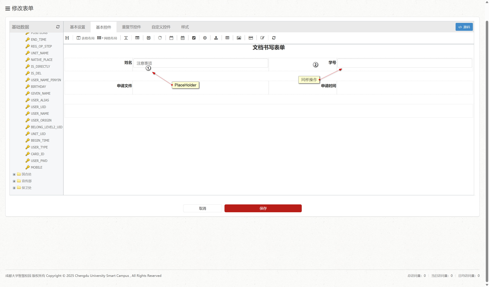

## 5. 添加基础数据
- 在左侧基础数据中，依次点击学生处，学生基础信息。  
- 下滑找到`USER_NAME`和`USER_ID`，分别对应拖拽到姓名和学号单元格中。  

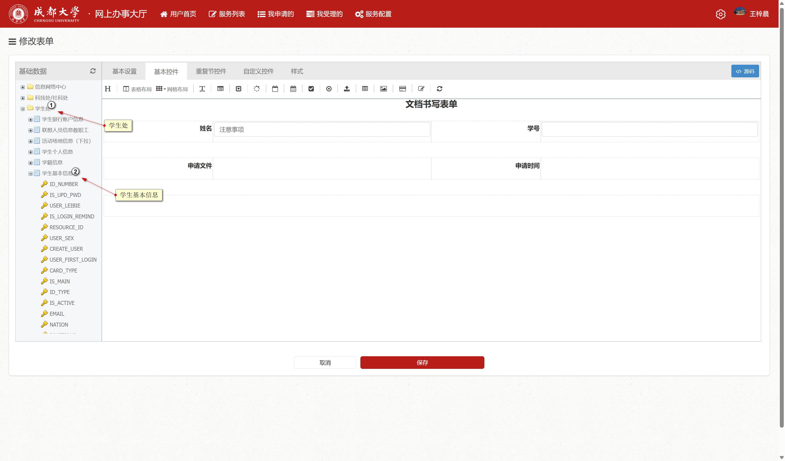
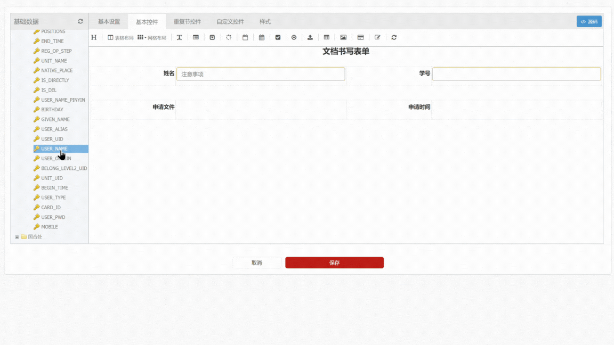

## 6. 添加上传文件控件
- 在第二个四列网格布局中，点击**上传文件**控件  

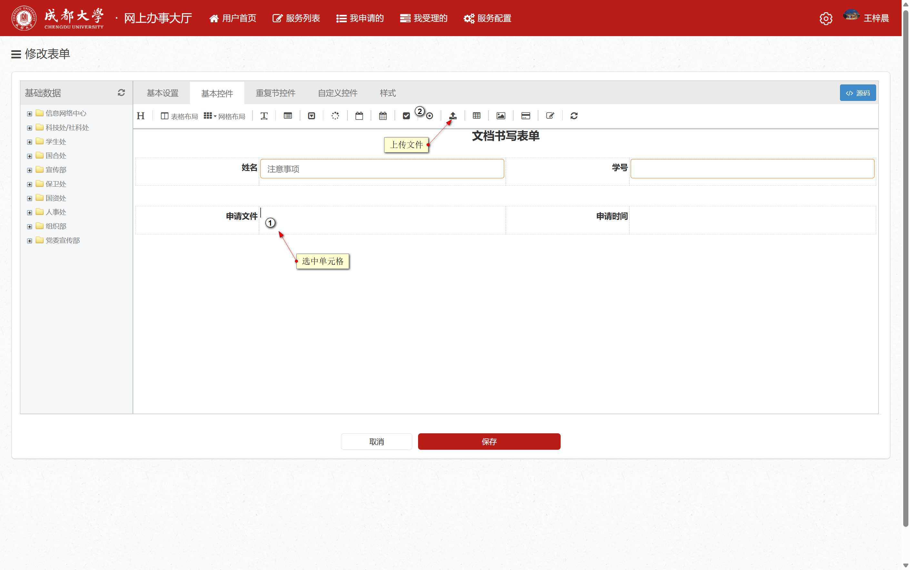

- 根据需要修改名称，勾选必填，设置上传文件格式  

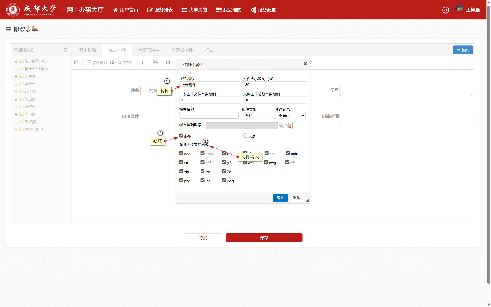

## 7. 添加日期控件
- 在第二个四列网格布局中，点击**日期**控件

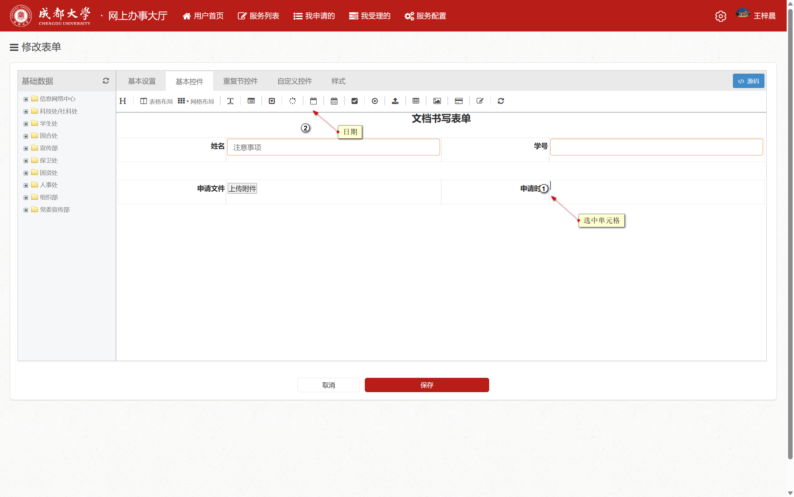

- 必须修改**名称和ID**，设置日期格式，勾选必填

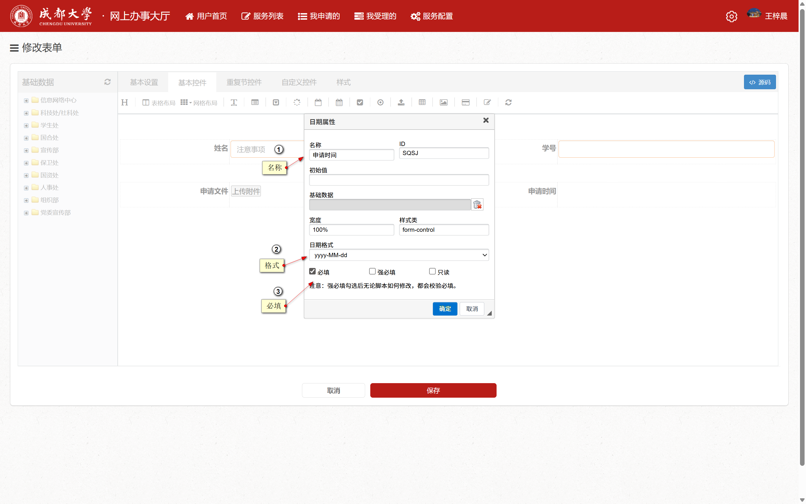

## 8. 添加数据表格控件
- 在最后一列网格布局中，点击**数据表格**控件

- 第一和第二步必须修改名称和ID
- 第三步填写列名和列名ID
- 第四步根据需要添加更多

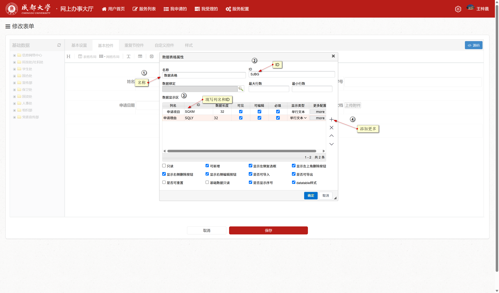

## 9. 完成表单设计
至此，一个简单的数据表单设计完成。
- 请点击保存

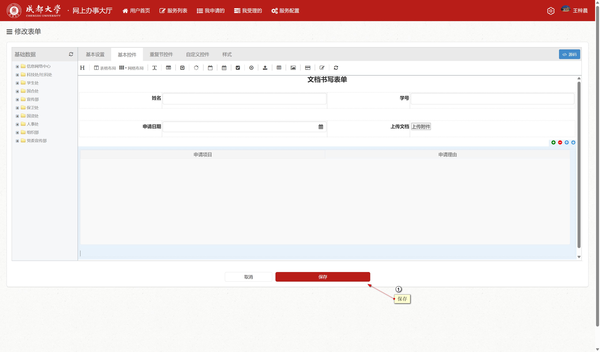