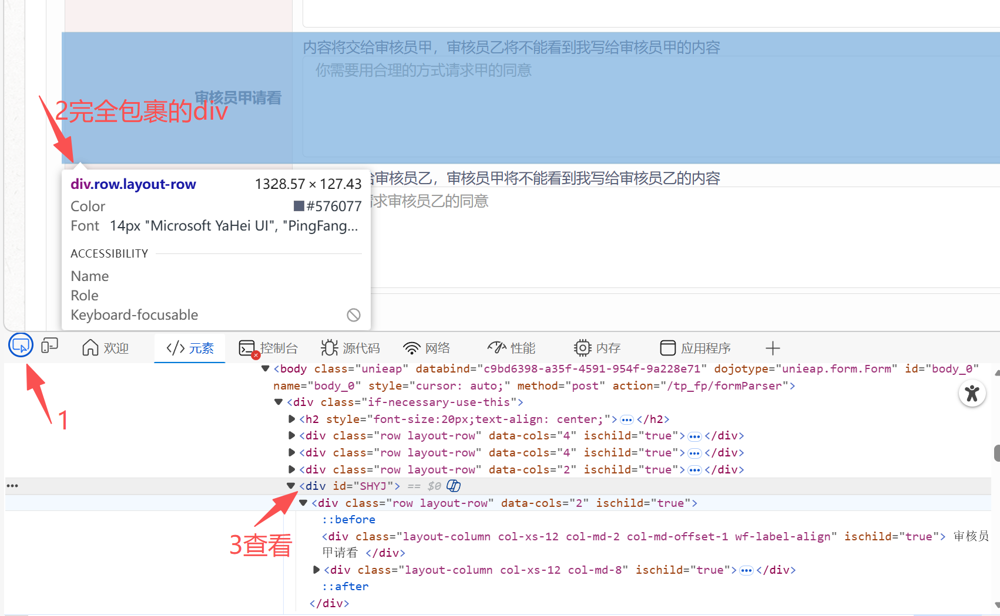
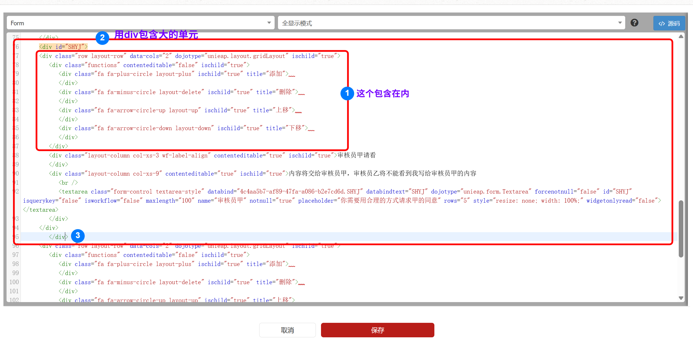
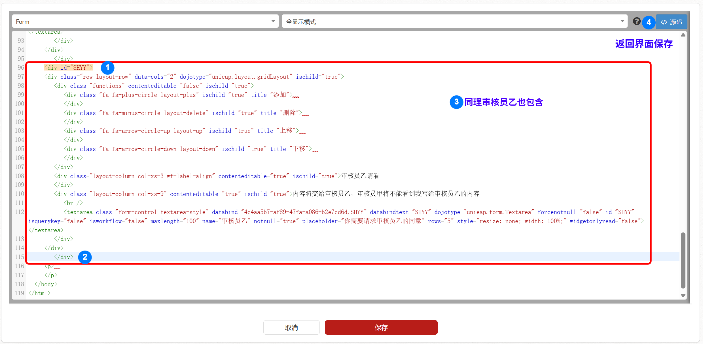
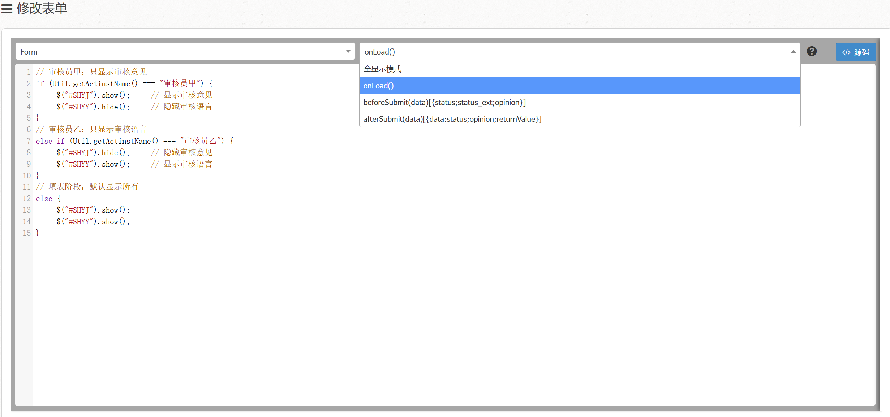
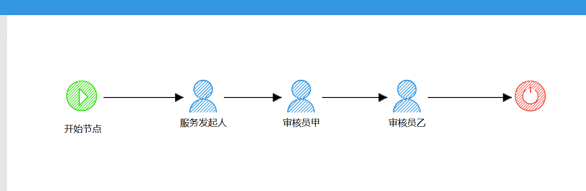
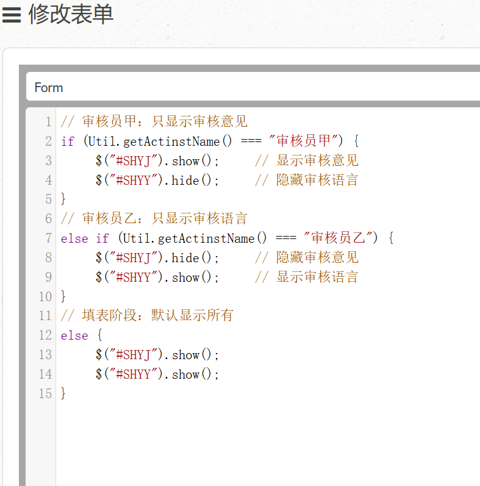
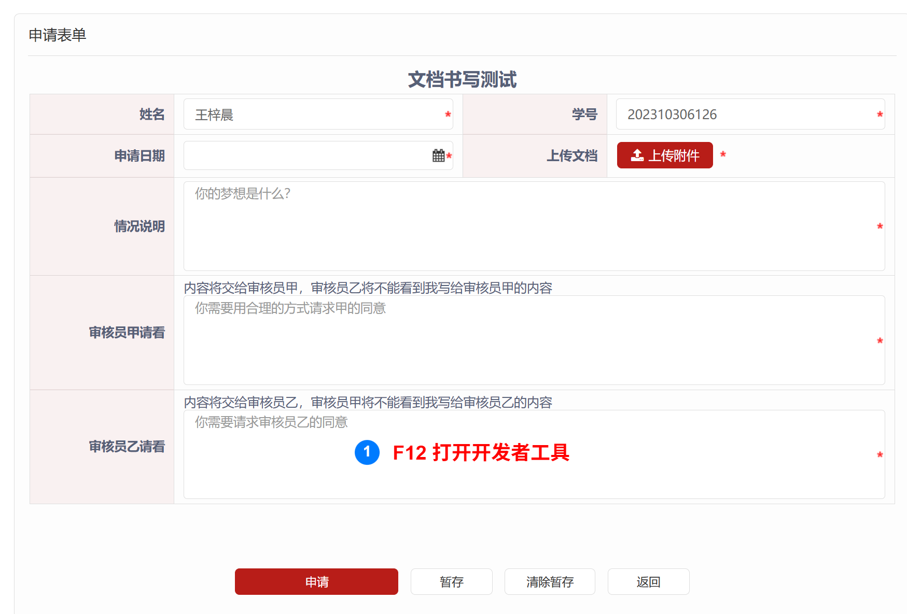
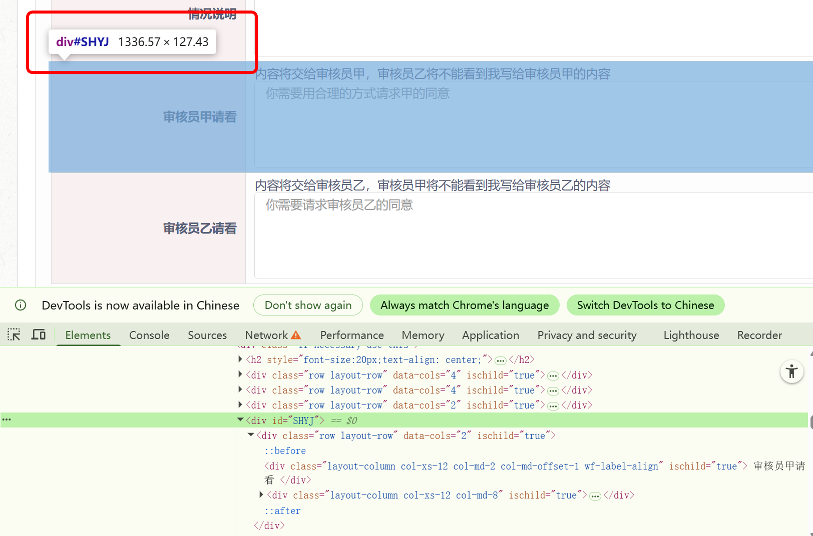
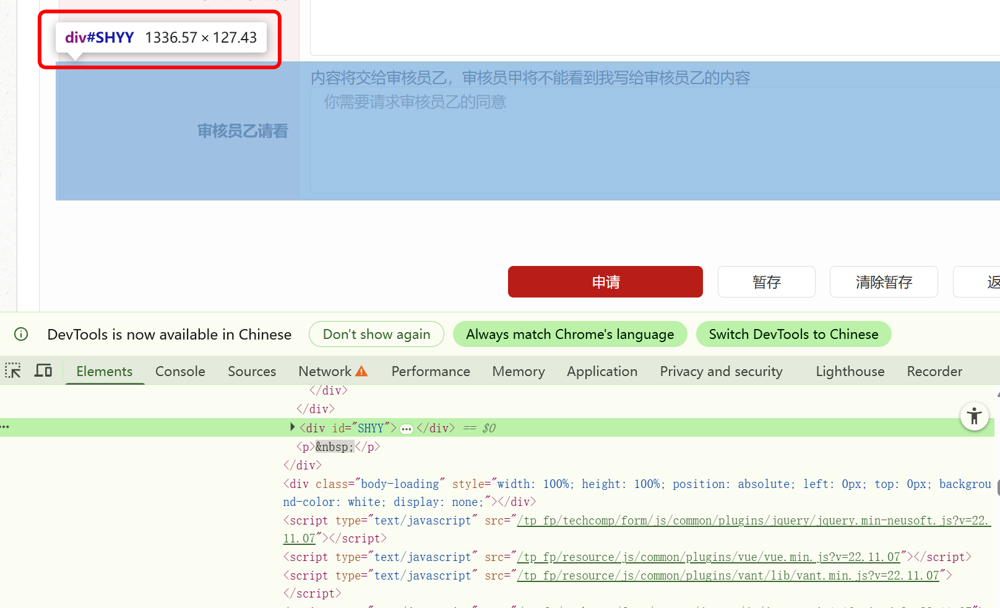

>上一次更新12月30日，2025
>Alex

# 表单控制显隐
{: .no_toc }
本节介绍，如何使用 **JavaScript** 动态控制表单控件的显示或隐藏，实现更灵活的表单交互。

## 目录
{: .no_toc .text-delta }

1. TOC
{:toc}

## 什么是表单控制显隐
表单控制显隐是一种**条件逻辑**功能，可以根据特定条件动态控制某些控件的显示或隐藏状态。

**典型应用场景：**
- 填表者上传内容太多，让**对应审核员**只看到需要审核的部分

## 查看显隐单元
首先，明确需要控制显隐的**单元**（控件或控件组）。  

**确定以下内容：**
- 哪个控件的值作为**触发条件**
- 哪些控件需要**显示/隐藏**  
完成下一步**包裹目标单元**后，你就能看到，第3步查看的`<div id="SHYJ"> ... </div>`
  

- 接着打开源码


## 包裹目标单元
使用 `<div id="SHYJ"> ... </div>` 标签将需要控制显隐的单元包裹起来。  



> **提示：** 接下来同样操作包裹<审核员甲>  

  

## 保存配置
测试通过后，点击**保存**，完成显隐配置。


## 编写 JavaScript 逻辑
在表单的 **onload** 事件中编写 JavaScript 代码，控制显隐逻辑。

  

### 完整示例

根据当前用户角色控制字段显示/隐藏：

```javascript

// 审核员甲：只显示审核意见
if (Util.getActinstName() === "审核员甲") {
    $("#SHYJ").show();    // 显示审核意见
    $("#SHYY").hide();    // 隐藏审核语言
}
// 审核员乙：只显示审核语言
else if (Util.getActinstName() === "审核员乙") {
    $("#SHYJ").hide();    // 隐藏审核意见
    $("#SHYY").show();    // 显示审核语言
}
// 填表阶段：默认显示所有
else {
    $("#SHYJ").show();
    $("#SHYY").show();
}
```  

>这里的**用户角色名**需要和你的流程保持一致
>

**逻辑说明：**
- 填表阶段：所有字段默认显示
- 审核员甲登录：只看到审核员甲字段
- 审核员乙登录：只看到审核员乙字段



## 检查div
配置完成后，回到填表申请界面。



**测试要点：**
- 修改触发控件的值，观察目标单元的显隐状态
- 测试各种条件组合，确保逻辑正确  

  




## 常见问题

### 隐藏的单元数据会被提交吗？
是的，隐藏的单元数据仍然会被提交。如果需要清空隐藏时的数据，请在隐藏逻辑中添加清空代码。

### 显隐不生效怎么办？
1. 检查包裹单元时，`<div id="xxx">` 中的 ID 是否正确
2. 检查 JS 代码中的 `$("#xxx")` 是否与上面的 ID 一致
3. 打开浏览器开发者工具（F12），查看 Console 是否有红色报错信息
4. 确认 JS 代码已正确保存并发布了表单

### 可以控制多个单元吗？
可以。用不同的 `<div id="xxx">` 包裹每个需要控制的单元，在 JS 中分别用 `$("#xxx").show()` 或 `$("#xxx").hide()` 控制即可。

## 注意事项
- 显隐逻辑在表单加载时就会执行，请确保初始状态正确
- 避免过多的显隐嵌套，以免影响性能
- 建议在正式发布前，充分测试各种场景
