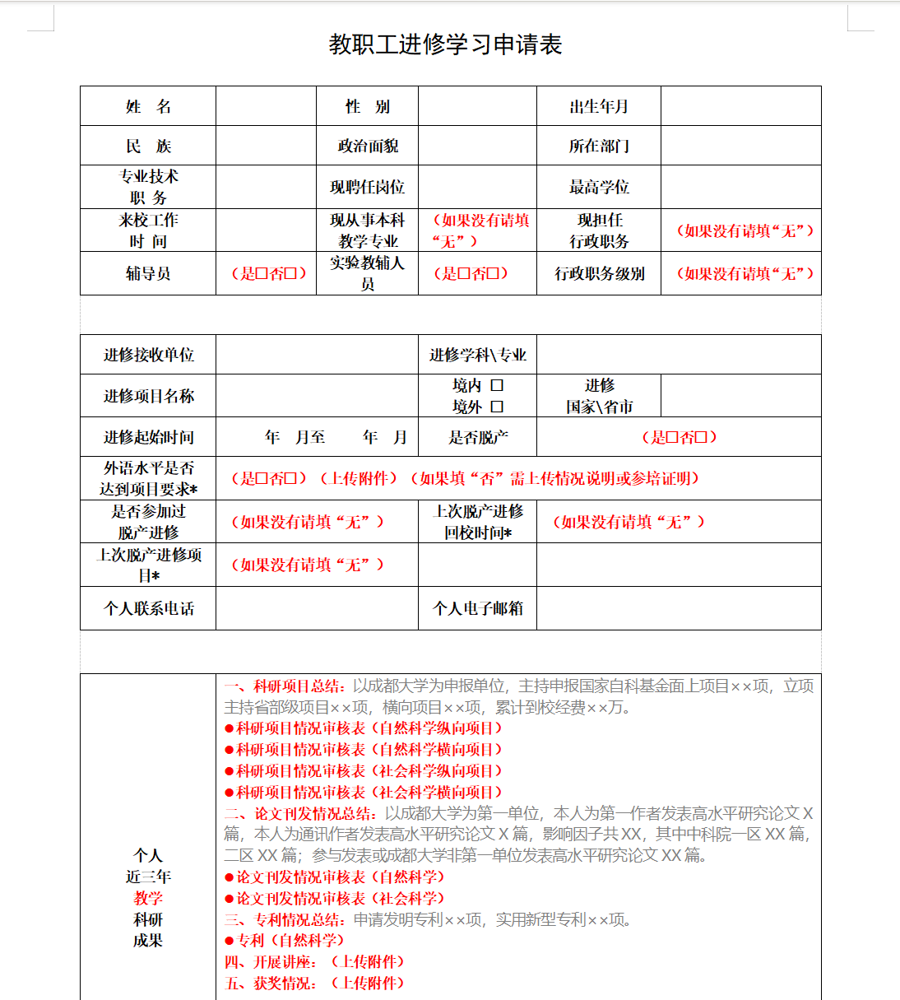
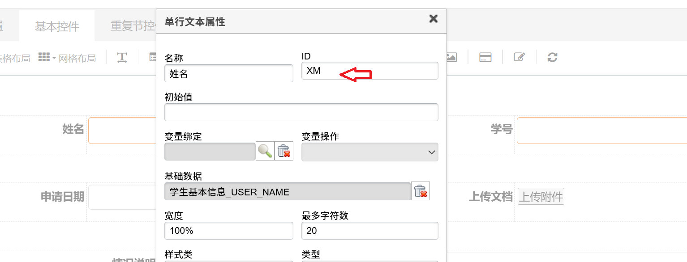
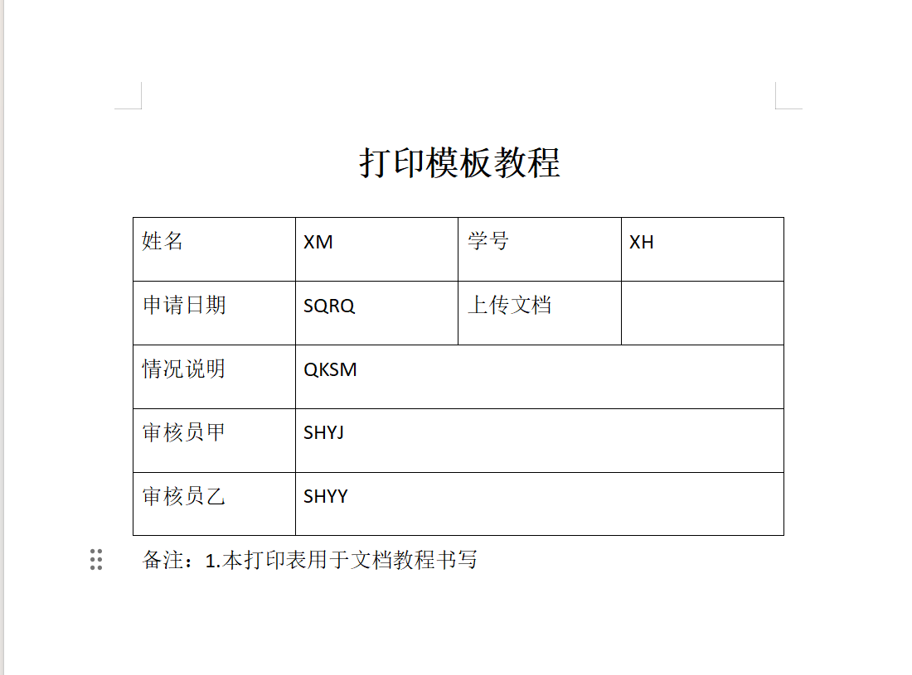
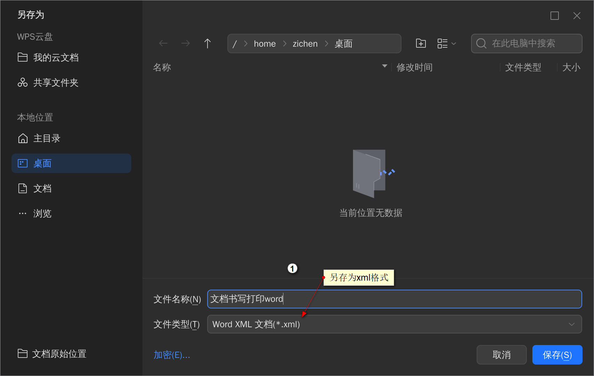

>上一次更新11月18日，2025  
>Alex 编写

# docx打印模板

## 1.准备工作

您已经学习了如何创建填表服务和基础的表单设计，现在是时候了解如何将表单打印输出了。

### 前提条件

- 从客户得到的打印模板文件，通常是一个.docx文件。
- 已经创建并发布了这个填表服务。
- 编辑xml模板文件的工具（[在线xml格式化](https://www.jyshare.com/front-end/710/)、[visual studio code搭配xml插件](./visualStudioCode.md)）

## 2.打印模板文件

客户给到的打印模板文件通常是一个.docx文件，首先您确保已经创建并且发布了这个填表服务。

然后我们要做的就是在客户完成相关审批后，将在线表单中的数据填充到这个打印模板中，生成最终的打印文件。

  

---  

 1.在线表单对应ID
- 例如：这是我的在线表单，设置的姓名ID为`XM`  

  

 2.在`.docx`模板中填上对应ID
>这步操作是为了在后续替换字段时，方便我们找到对应位置。  

  

>注意：  
>- 一定要确保在线表单中的ID和打印模板中的ID一致，否则无法正确替换字段。  
>- 保存word文档时，请不要将光标移动到任何ID位置，这可能触发word的书签功能，导致后续替换字段失败。  

## 3.将docx文件重命名为xml文件
将客户提供的.docx文件后缀名改为xml文件，方便我们后续进行编辑。

## 4.编辑xml文件
使用文本编辑器[在线xml格式化](https://www.jyshare.com/front-end/710/)或者[visual studio code搭配xml插件](./visualStudioCode.md)打开xml文件，找到需要替换的字段位置。