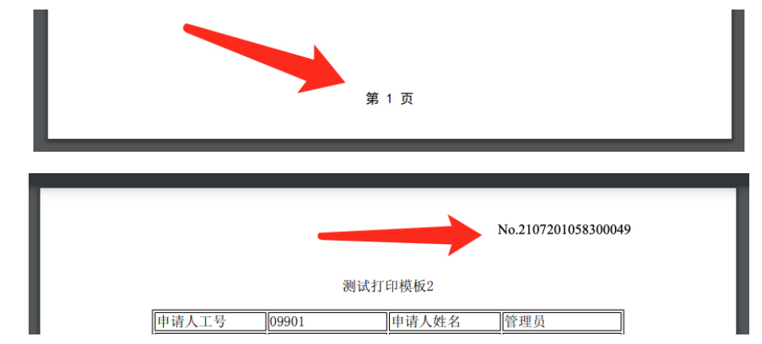
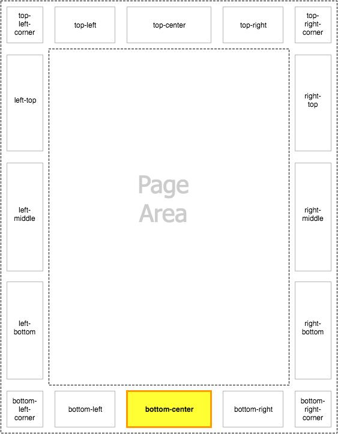
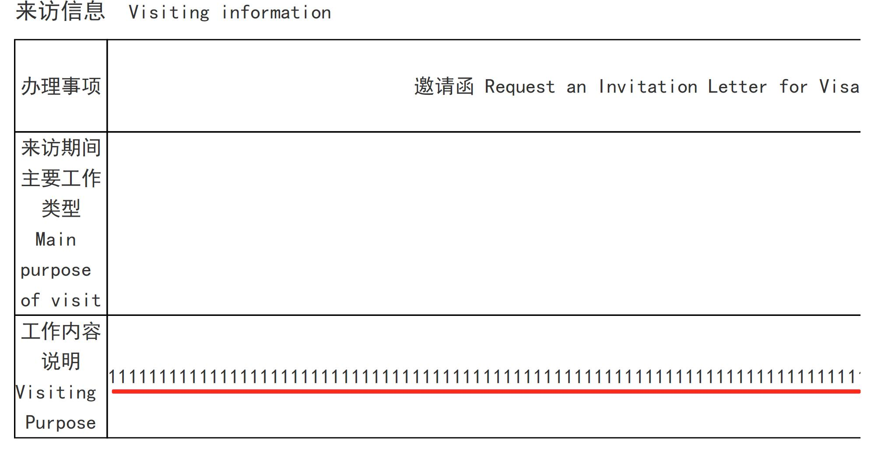
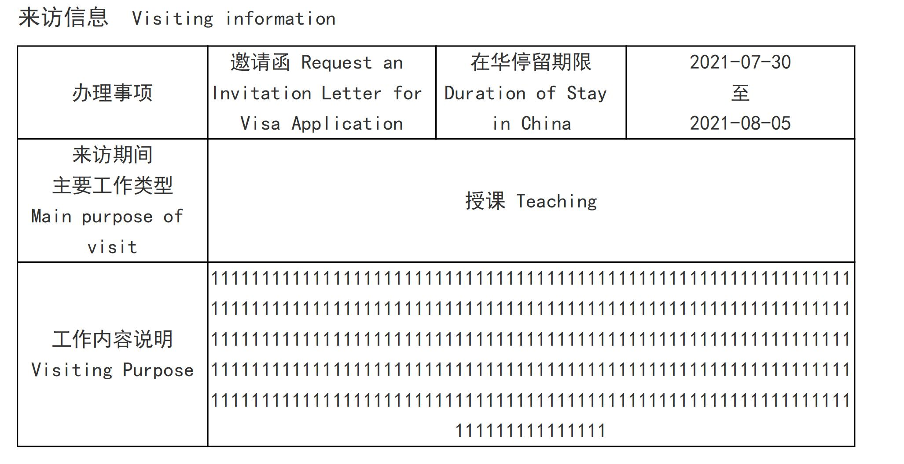
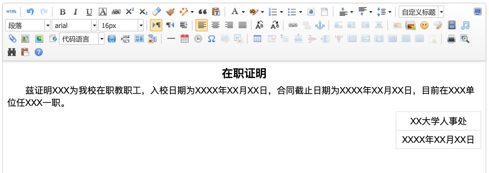
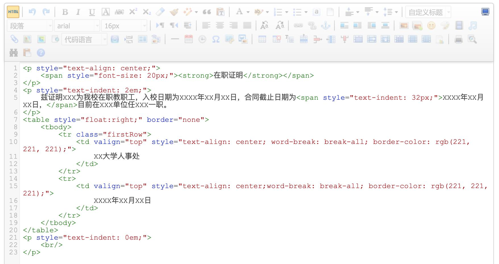

> 上一次更新 12月16日，2025
> Alex

# PDF 打印模板参考
{: .no_toc }

## 目录
{: .no_toc .text-delta }

1. TOC
{:toc}

## 核心流程

制作 PDF 打印模板本质上只需三步：

1. **制作 HTML**：编写一个静态的 HTML 页面，调整好样式。
2. **插入变量**：使用 Freemarker 语法将动态数据替换进 HTML 中。
3. **修改后缀**：将 `.html` 文件后缀修改为 `.ftl` 并上传。

---

## 第一部分：HTML 编写规范（硬性要求）

由于 PDF 渲染引擎的特殊性，编写 HTML 时必须遵守以下规则，否则会导致乱码或样式丢失。

### 样式内联

由于只能上传一个 `.ftl` 文件，**不能引用外部 CSS 文件**。

* 所有样式必须写在 `<head>` 中的 `<style>` 标签内。
* 或者直接写在 HTML 元素的 `style` 属性中。

### 中文字体必须指定

渲染引擎默认不支持中文，**必须为所有可能出现中文的元素指定字体**。

> **注意**：CSS 中不能写中文名称（如 `宋体`），必须使用对应的英文代码。

| 字体   | CSS 代码 (font-family) |
| :----- | :--------------------- |
| 宋体   | `SimSun`               |
| 新宋体 | `NSimSun` (推荐)       |
| 黑体   | `SimHei`               |
| 仿宋   | `FangSong`             |
| 楷体   | `KaiTi`                |

**建议做法**：直接在 body 中定义全局字体。

```css
body { font-family: SimHei; }
```

### 单位使用 pt 而非 px

* **px (像素)**：屏幕显示单位。
* **pt (磅)**：印刷行业单位（1pt = 1/72英寸）。
* **建议**：字体大小、缩进、边距均使用 `pt`，以保证打印效果与预期一致。

| 字号 | 磅 (pt) | 字号 | 磅 (pt) |
| :--- | :------ | :--- | :------ |
| 初号 | 42      | 小三 | 15      |
| 小初 | 36      | 四号 | 14      |
| 一号 | 26      | 小四 | 12      |
| 小一 | 24      | 五号 | 10.5    |
| 二号 | 22      | 小五 | 9       |
| 小二 | 18      | 六号 | 7.5     |
| 三号 | 16      |      |         |

### 图片处理 (Base64)

由于无法引用外部图片文件，所有图片（如 Logo、水印）必须转换为 **Base64 编码** 直接写入 HTML。

* 图片大小建议不超过 300KB。
* [在线图片转 Base64 工具](https://www.sojson.com/image2base64.html)

```html
<!-- 示例 -->

```

### 禁用特殊转义字符

尽量避免使用 `&nbsp;` 等以 `&` 开头的转义字符，引擎可能会将其误判为变量。

* **替代方案**：使用十进制编码。

| 字符 | 推荐写法 (十进制) | 避免写法 |
| :--- | :---------------- | :------- |
| 空格 | `&#160;`          | `&nbsp;` |
| <    | `&#60;`           | `<`      |
| >    | `&#62;`           | `>`      |
| &    | `&#38;`           | `&`      |

---

## 第二部分：样式与布局技巧（常见问题）

### 设置纸张与页边距

使用 CSS 的 `@page` 指令控制纸张。

```css
/* A4 纵向，自定义页边距 */
@page { size: A4; margin: 2.54cm 3.18cm; }

/* A3 横向 */
@page { size: A3 landscape; margin: 2.54cm 3.28cm; }
```

### 添加页眉与页码

同样在 `@page` 中设置。

```css
@page {
    size: A4;
    margin: 2.54cm 3.18cm;
    /* 底部居中显示页码 */
    @bottom-center { content: "第 " counter(page) " 页"; font-family: SimHei; }
    /* 右上角显示单号 */
    @top-right { content: "No.${FK_ID}"; }
}
```



想在更多位置放置内容，请参考下图布局：



### 处理长文本换行

解决英文字母或数字过长导致不换行的问题。



```css
body {
    word-wrap: break-word;
    word-break: break-all;
}
```

解决后效果：



### 表格跨页控制

防止表格的一行内容被切分到两页。

```css
tr {
    page-break-inside: avoid;
    page-break-after: auto;
}
```

### 快速制作工具推荐

如果你不擅长手写 HTML，可以使用 [UEditor 在线编辑器](https://ueditor.baidu.com/website/onlinedemo.html) 可视化编辑。



然后点击“HTML”按钮切换到源码模式，复制源码粘贴到你的模板 `body` 中。



---

## 第三部分：数据变量与 Freemarker 语法

使用 `${变量名}` 的格式在 HTML 中占位。

### 基础字段

* **普通字段**：`${XM}` (假设姓名字段 ID 为 XM)
* **申请编号**：`${FK_ID}` (系统自带)
* **下拉/联想字段**：
  * `${BM}`：输出选项值（Value）
  * `${BM_TEXT}`：输出选项文本（Label）

### 日期格式化

默认输出格式为 `yyyy-mm-dd`。如需自定义，使用 `_格式` 后缀。

| 写法              | 效果     |
| :---------------- | :------- |
| `${DATE_yyyy}`    | 2025     |
| `${DATE_mm_CN}`   | 十二     |
| `${DATE_yyyy_CN}` | 二〇二五 |

### 表格循环 (Grid)

使用 `<#list>` 标签遍历明细表数据。

```html
<#list grid_0 as item>
    <tr>
        <td>${item.XH}</td> <!-- 序号 -->
        <td>${item.XM}</td> <!-- 姓名 -->
    </tr>
</#list>
```

### 审批历史循环

遍历流程节点的办理情况。

```html
<#list APPROVE_HISTORY as history>
    <tr>
        <td>${history.approve_name}</td>   <!-- 环节名称 -->
        <td>${history.approve_person}</td> <!-- 办理人 -->
        <td>${history.approve_opinion}</td> <!-- 意见 -->
        <td>${history.approve_result}</td>  <!-- 结果 -->
        <td>${history.approve_date}</td>    <!-- 时间 -->
    </tr>
</#list>
```

### 获取特定节点最后办理信息

适用于在表格固定位置显示某环节的签字。

* 办理人：`${节点名称_LAST.approve_person}`
* 办理意见：`${节点名称_LAST.approve_opinion}`
* 手写签名图片：`${节点名称_LAST.SIGNATURE_SRC}`

### 系统预置变量

| 变量名                 | 说明               |
| :--------------------- | :----------------- |
| `${CURRENT_USER_NAME}` | 当前打印操作人姓名 |
| `${CREATE_USER_NAME}`  | 表单发起人姓名     |
| `${SYSDATE}`           | 当前系统日期       |
| `${START_DATE}`        | 申请发起日期       |

### 高级用法示例

**显示上传的图片附件：**

```html

```

**日期计算（如：审批日期 + 5天）：**

```html
${(国际处审批_LAST.approve_date?date?long + 5 * 86400000)?number_to_date?string.iso}
```

---

## 参考资源

* **Freemarker 指令参考**：[http://freemarker.foofun.cn/ref_directive_if.html](http://freemarker.foofun.cn/ref_directive_if.html)
* **示例模板**：可参考资源包中的[《境外专家短期来访审批表.ftl》](../../assets/resources/expert-approval.ftl)。
