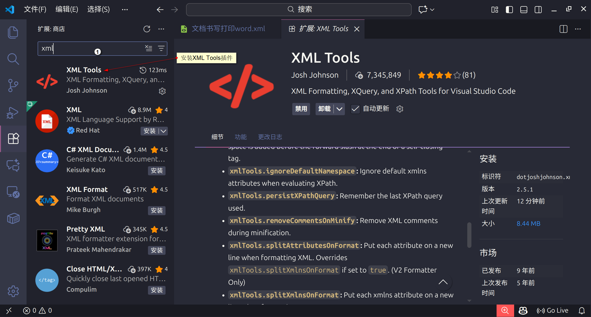
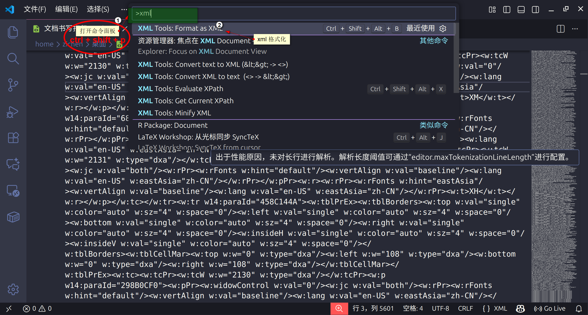
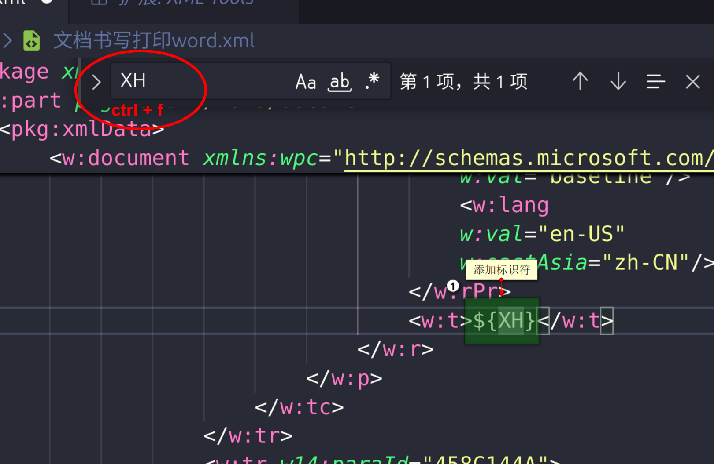

# visualStudioCode和xml插件

[visual Studio Code下载链接](https://code.visualstudio.com/download) 

## 1.安装visual Studio Code和插件  

- 安装完成后，打开visual Studio Code
- 点击左侧扩展图标，搜索`XML Tools`，找到后点击安装。
  

## 2.使用visual Studio Code打开xml文件  
- 使用visual Studio Code打开之前重命名的xml文件
- 使用xml插件格式化  
    - `ctrl+shift+p`，输入`XML Tools: Format as XML`,点击即可格式化  

## 3.修改对应ID位置  

- 例如`ctrl + F`，找到`XM`
- 修改为`${XM}`
- 其余ID同理，`${ID}`  

  

- 修改完成后，保存文件即可

## 4.另存为ftl文件

- 在vscode里，`ctrl + shift + S`另存为ftl文件。
- 或者在 --> file --> save as --> 选择保存类型为所有文件 --> 输入文件名`模板.ftl` --> 保存