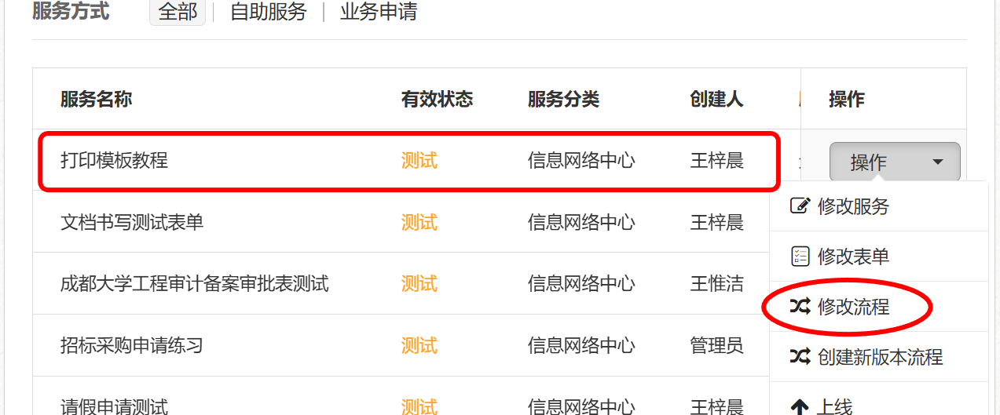

# 上传打印模板  

## 1.打印模板管理  

- 服务配置
- 打印模板管理，添加

  
  

  

## 2.上传打印模板文件ftl  
- 模板编号：一般为拼音，首字母大写
- 选择word文件模板
- 上传之前保存好的ftl文件

## 3.修改流程选择打印模板  
- 回到-->服务配置-->修改流程
  

- 空白处右键，点击流程属性
  

- 粘贴对应模板编号，我这里是`DYMBJC`
- 下滑
  

- 选择打印
- 保存
