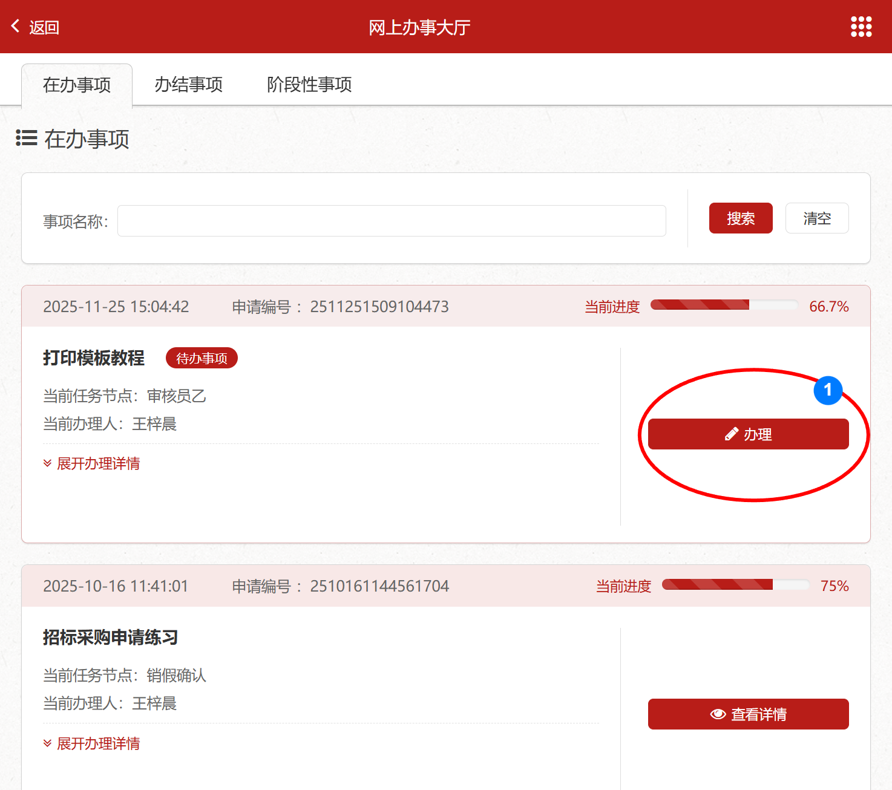

# 使用打印模板
{: .no_toc }  

## 目录  
{: .no_toc .text-delta }  

1. TOC
{:toc}  

## 前提条件  
- 一个已上线的填表服务A
- 配置了打印模板文件到填表服务A中

## 使用docx打印模板步骤  

- 打开已上线的填表服务A，填写表单内容
  

- 提交表单，进入审批流程，完成相关审批操作  

- 办结事项里，导出
  

- 完成docx导出

